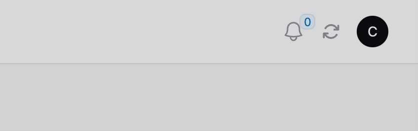

# 定制面板

在 [`Filament`](https://filamentphp.com/docs) 中允许对管理面板进行一些自定义，比如更改主题配色、更改字体、更改界面的 Logo 等。

它们的修改都是在 `app/Providers/Filament/AdminPanelProvider.php` 文件的 `panel` 方法中。

## 更改主题配色 `colors()`

1. 通过 `color` 方法指定具体配色，它们默认来自 [tailwind 自定义颜色](https://tailwindcss.com/docs/customizing-colors)。

    ```php
    use Filament\Panel;
    use Filament\Support\Colors\Color;

    public function panel(Panel $panel): Panel
    {
        return $panel
            // ...
            ->colors([
              'danger' => Color::Red,
              'gray' => Color::Slate,
              'info' => Color::Blue,
              'primary' => Color::Blue,
              'success' => Color::Green,
              'warning' => Color::Amber,
            ]);
    }
    ```

2. 使用非 Tailwind 提供的颜色

    - 通过以 RGB 格式传递从 50 到 950 的色调数组来使用 Tailwind CSS 调色板中未包含的自定义颜色

   ```php
    use Filament\Support\Facades\FilamentColor;

    public function boot()
    {
        FilamentColor::register([
            'danger' => [
                50 => '254, 242, 242',
                100 => '254, 226, 226',
                200 => '254, 202, 202',
                300 => '252, 165, 165',
                400 => '248, 113, 113',
                500 => '239, 68, 68',
                600 => '220, 38, 38',
                700 => '185, 28, 28',
                800 => '153, 27, 27',
                900 => '127, 29, 29',
                950 => '69, 10, 10',
            ],
        ]);
    }
   ```

   - 从十六进制代码生成自定义颜色 `Color::hex()`

   ```php
   use Filament\Support\Colors\Color;
   use Filament\Support\Facades\FilamentColor;

   FilamentColor::register([
       'danger' => Color::hex('#ff0000'),
   ]);
   ```

   - 从 RGB 值生成自定义颜色 `Color::rgb()`

   ```php
   use Filament\Support\Colors\Color;
   use Filament\Support\Facades\FilamentColor;

   FilamentColor::register([
       'danger' => Color::rgb('rgb(255, 0, 0)'),
   ]);
   ```

3. 使用 rgb 方式

```php
use Filament\Panel;
use Filament\Support\Colors\Color;

public function panel(Panel $panel): Panel
{
   return $panel
       // ...
       ->colors([
         'primary' => '#6366f1',
         'danger' => 'rgb(99, 102, 241)',
       ]);
}
```

## 更改字体 `font()`

默认情况下，Filament 使用的是 [Inter](https://fonts.bunny.net/family/inter) 字体。可以使用 `font()` 方法更改默认设置。

```php
use Filament\Panel;
 
public function panel(Panel $panel): Panel
{
    return $panel
        // ...
        ->font('JetBrains Mono');
}
```

### 使用本地字体

如果想从本地样式表提供字体，则可以使用 `LocalFontProvider`：

```php
use Filament\FontProviders\LocalFontProvider;
 
$panel->font(
    'Inter',
    url: asset('css/fonts.css'),
    provider: LocalFontProvider::class,
)
```

## 添加Logo `logo()`

默认情况下，`Filament` 使用 `.env` 文件中的 `APP_NAME` 配置的文本来呈现简单的 Logo 。

### `brandName()`

如果想简单地更改徽标中使用的文本，可以使用 `brandName()` 方法：

```php
use Filament\Panel;
 
public function panel(Panel $panel): Panel
{
    return $panel
        // ...
        ->brandName('Filament App');
}
```

### `brandLogo()`

如果需要渲染图像的话可以将 URL 传递给 `brandLogo()` 方法：

```php
use Filament\Panel;
 
public function panel(Panel $panel): Panel
{
    return $panel
        // ...
        ->brandLogo(asset('images/logo.svg'));
}
```

或者也可以直接将 HTML 通过回调函数传递给 `brandLogo()` 方法来渲染内联 SVG 元素。

```php
use Filament\Panel;
 
public function panel(Panel $panel): Panel
{
    return $panel
        // ...
        ->brandLogo(fn () => view('filament.admin.logo'));
}
```

如果需要在应用程序处于深色模式时使用不同的 Logo ，可以以相同的方式将其传递给 `darkModeBrandLogo()` 。

可以使用 `brandLogoHeight()` 方法自定义渲染 Logo 的高度。

```php
use Filament\Panel;
 
public function panel(Panel $panel): Panel
{
    return $panel
        // ...
        ->brandLogo(fn () => view('filament.admin.logo'))
      	->darkModeBrandLogo(fn () => view('filament.admin.dark-logo'))
        ->brandLogoHeight('2rem');
}
```

## 开启 spa 模式 `spa()`

SPA 模式利用 [Livewire 的 wire:navigate](https://livewire.laravel.com/docs/navigate) 功能，使服务器渲染的面板感觉像单页面应用程序，页面加载之间的延迟更短，并且针对较长的请求提供加载栏。要在面板上启用 SPA 模式，可以使用 `spa()` 方法

```php
use Filament\Panel;
 
public function panel(Panel $panel): Panel
{
    return $panel
        // ...
      	->spa();
}
```

## 更改后台路径

在 `AdminServerProvider.php` 文件中，可以使用 `path()` 方法更改应用程序可访问的路径：

```php
use Filament\Panel;
 
public function panel(Panel $panel): Panel
{
    return $panel
        // ...
        ->path('cp');
}
```

如果希望应用程序无需任何前缀即可访问，可以将其设置为空字符串：

```php
use Filament\Panel;
 
public function panel(Panel $panel): Panel
{
    return $panel
        // ...
        ->path('');
}
```

>  这样的话需要注意，保持 `routes/web.php` 文件中没有对 `/` uri 有定义。否则，`routes/web.php` 中定义的路由优先级会更高。

## 更改登录和注册地址

在 `AdminServerProvider.php` 文件中，使用 `loginRouteSlug('singin')` 配置登录的 `uri`，使用 `registrationRouteSlug('signup')` 配置注册的 `uri`。

```php
use Filament\Panel;
 
public function panel(Panel $panel): Panel
{
    return $panel
        // ...
        ->loginRouteSlug('signin')  
		->registrationRouteSlug('signup');
}
```

## 更改登录/注册表单

如果在一些项目中需要覆盖登录/注册表单中字段的标签、默认值等，请按照以下步骤操作。

1. 创建自定义的类并继承自 `Filament\Pages\Auth\Login`

   ```php
   // app\Filament\Pages\Auth\Login.php

   namespace App\Filament\Pages\Auth;
    
   use Filament\Pages\Auth\Login as BaseLogin;
    
   class Login extends BaseLogin
   {
       // Any customizations will go here
   }
   ```

2. 在 `AdminPanelServiceProvider` 中指定该类

   ```php
   // app/Providers/Filament/AdminPanelProvider.php

   // ...
   use App\Filament\Pages\Auth\Login;
    
   public function panel(Panel $panel): Panel
   {
     // ...
     $panel->login(Login::class),
   }
   ```

3. 覆盖对应字段的方法
 
   比如下面对 `Email` 和 `Password` 字段进行覆盖，设置默认值。
   ```php
   // app\Filament\Pages\Auth\Login.php

   <?php

   namespace App\Filament\Resources\Pages\Auth;

   use Filament\Forms\Components\Component;
   use Filament\Pages\Auth\Login as BaseLogin;

   class Login extends BaseLogin
   {
        protected function getEmailFormComponent(): Component
        {
           $component = parent::getEmailFormComponent();

           $component->default('test@example.com'); // ![code ++]

           return $component;
       }

       protected function getPasswordFormComponent(): Component
       {
           $component = parent::getPasswordFormComponent();

           $component->default('password'); // ![code ++]

           return $component;
       }
   }
   ```

更多 Filament 自带的页面类可以[查看仓库对应文件覆盖的可用方法的列表](https://github.com/filamentphp/filament/tree/3.x/packages/panels/src/Pages/Auth)。

## 使用用户名或电子邮件登录

默认情况下，Filament 支持使用邮箱进行登录，可以通过对 `Login` 类进行重写完成扩展。

1. 创建自定义的类并继承自 `Filament\Pages\Auth\Login`

   ```php
   // app\Filament\Pages\Auth\Login.php
   namespace App\Filament\Pages\Auth;
    
   use Filament\Pages\Auth\Login as BaseLogin;
    
   class Login extends BaseLogin
   {
       // Any customizations will go here
   }
   ```
   > Laravel 11+，可以通过命令快速创建类。`php artisan make:class Filament\Pages\Auth\Login`

2. 在 `FilamentServiceProvider` 中注册自定义的类
   ```php

   php
   // app/Providers/Filament/AdminPanelProvider.php

   // ...
   use App\Filament\Pages\Auth\Login;
    
   public function panel(Panel $panel): Panel
   {
     // ...
     $panel->login(Login::class),
   }
   ```

3. 覆盖对应字段的方法

```php
<?php

namespace App\Filament\Pages\Auth;

use Filament\Forms\Components\Component;
use Filament\Forms\Components\TextInput;
use Illuminate\Validation\ValidationException;

class Login extends \Filament\Pages\Auth\Login
{
    protected function getForms(): array
    {
        return [
            'form' => $this->form(
                $this->makeForm()
                    ->schema([
                        $this->getNameOrEmailFormComponent(), // [!code ++]
                        $this->getEmailFormComponent(), // [!code --]
                        $this->getPasswordFormComponent(),
                        $this->getRememberFormComponent(),
                    ])
                    ->statePath('data'),
            ),
        ];
    }

    protected function getNameOrEmailFormComponent(): Component
    {
        return TextInput::make('name_or_email')
            ->label('Name Or Email')  // [!code ++]
            ->label(__('filament-panels::pages/auth/login.form.email.label'))  // [!code --]
            ->email() // [!code --]
            ->required()
            ->autocomplete()
            ->autofocus()
            ->extraInputAttributes(['tabindex' => 1]);
    }

    /**
     * @param  array<string, mixed>  $data
     * @return array<string, mixed>
     */
    protected function getCredentialsFromFormData(array $data): array
    {
        $type = filter_var($data['name_or_email'], FILTER_VALIDATE_EMAIL)
            ? 'email'
            : 'name';
        return [
            'email' => $data['email'], // [!code --]
            $type => $data['name_or_email'], // [!code ++]
            'password' => $data['password'],
        ];
    }

    protected function throwFailureValidationException(): never
    {
        throw ValidationException::withMessages([
            'data.email' => __('filament-panels::pages/auth/login.messages.failed'),  // [!code --]
            'data.name_or_email' => __('filament-panels::pages/auth/login.messages.failed'),  // [!code ++]
        ]);
    }
}
```

经过上面的自定义配置后，登录页面允许使用用户名或密码进行登录。


## 添加网站 favicon 图标

使用 `favicon` 方法传递图标的公共 URL 来达到定制网站图标 favicon 的目的。

```php
use Filament\Panel;
 
public function panel(Panel $panel): Panel
{
    return $panel
        // ...
        ->favicon(asset('images/favicon.png'));
}
```

## 渲染钩子 `renderHook` 

要注册渲染钩子，可以从服务提供商 Provider 或中间件 Middleware 中调用 `FilamentView::registerRenderHook()`。其中第一个参数是渲染钩子的名称，第二个参数是返回要渲染的内容的回调：

```php
use Filament\Panel;
use Filament\View\PanelsRenderHook;
use Illuminate\Support\Facades\Blade;
 
public function panel(Panel $panel): Panel
{
    return $panel
        // ...
        ->renderHook(
            PanelsRenderHook::BODY_START,
            fn (): string => Blade::render('@livewire(\'livewire-ui-modal\')'),
        );
}
```

也可以使用 `registerRenderHook()` 方法渲染渲染指定文件的内容：

```php
use Filament\Support\Facades\FilamentView;
use Illuminate\Contracts\View\View;
use Filament\View\PanelsRenderHook;

FilamentView::registerRenderHook(
    PanelsRenderHook::BODY_START,
    fn (): View => view('impersonation-banner'),
);
```

更多可用的钩子名称[可以在这里查看](https://filamentphp.com/docs/3.x/support/render-hooks#available-render-hooks)。

### 添加刷新缓存按钮

在管理页面头部用户菜单之前 `Filament\View\PanelsRenderHook::USER_MENU_BEFORE` 添加一个刷新缓存按钮，点击该按钮可以刷新缓存。



使用命令 `php artisan make:livewire FlushQueryCache` 可以生成刷新缓存按钮的 Livewire 组件。

::: code-group
```php [App\Providers\Filament\AdminPanelProvider]
use Filament\Panel;
use Filament\View\PanelsRenderHook;
use Illuminate\Support\Facades\Blade;
 
public function panel(Panel $panel): Panel
{
    return $panel
        // ...
        ->renderHook(
            PanelsRenderHook::USER_MENU_BEFORE,
            fn (): string => $this->flushQueryCacheHook(),
        );
}

public function flushQueryCacheHook(): string
{
  return auth()->user()->isAdmin() ? Blade::render('@livewire(\'flush-query-cache\')') : '';
}
```

```php [App\Livewire\FlushQueryCache]
<?php

namespace App\Livewire;

use Livewire\Component;
use Illuminate\Contracts\View\View;
use Illuminate\Support\Facades\Artisan;
use Filament\Notifications\Notification;

class FlushQueryCache extends Component
{
    public function flushCache(): void
    {
        Artisan::call('cache:clear');

        Notification::make()
            ->title(__('admin.notification.query_cache_cleared_success'))
            ->duration(3000)
            ->success()
            ->send();
    }

    public function render(): View|string
    {
        return view('livewire.flush-query-cache');
    }
}
```

```php [resources/views/livewire/flush-query-cache.blade.php]
<a href="javascript:void(0);"
   x-data="{
        active: false,
        flushCache: function() {
            this.active = true;
            $wire.flushCache();
        }
   }"
   x-init="$watch('active', (value) => value && setTimeout(() => active = false, 1200))"
   @click="flushCache">

    <x-filament::loading-indicator x-show="active" class="w-5 h-5 text-gray-400 dark:text-gray-500"/>

    <x-filament::icon
            class="w-5 h-5 text-gray-400 dark:text-gray-500"
            x-show="!active"
            icon="heroicon-c-arrow-path"
            color="gray"
            icon-size="lg"
            :label="__('admin.notification.label')"
    />
</a>
```
:::


## 热加载

在开发项目时经常需要根据修改刷新页面，此时配置热加载显得尤为重要。

1. 配置 `vite.config.js`

   导入 `laravel-vite-plugin` 默认的刷新监听路径的同时添加额外的热加载目录。

    ```js
    import {defineConfig} from 'vite';
    import laravel, {refreshPaths} from 'laravel-vite-plugin';
    
    export default defineConfig({
        plugins: [
            laravel({
                input: ['resources/css/app.css', 'resources/js/app.js'],
                // refresh: true,
                refresh: [
                    ...refreshPaths,
                    'app/Livewire/**',
                    'app/Filament/**',
                ],
            }),
        ],
    });
    
    ```

2. 使用 `rederHook` 方法在管理页面注入 `resources/js/app.js`

    ```php
    use Filament\Panel;
    use Illuminate\Support\Facades\Blade;
     
    public function panel(Panel $panel): Panel
    {
        return $panel
            // ...
            ->renderHook(
                'panels::body.end',
                fn (): string => $this->app->environment('local')
                    ? Blade::render('@vite(\'resources/js/app.js\')')
                    : ''
            );
    }
    ```

进行上面的配置后，比如修改 Filament 表单字段的后会及时刷新页面，方便开发查看修改的结果。

## 设置域名

默认情况下，Filament 将响应来自所有域的请求。

如果想将其范围限制在特定域，可以使用 `domain()` 方法，类似于 Laravel 中的 `Route::domain()` 配置。

```php
use Filament\Panel;
 
public function panel(Panel $panel): Panel
{
    return $panel
        // ...
        ->domain('cp.domain.com');
}
```

## 自定义最大内容宽度

默认情况下，Filament 会限制页面内容的宽度，因此在大屏幕上不会变得太宽，要更改此设置，可以使用 `maxContentWidth()` 方法。

选项有：`ExtraSmall`, `Small`, `Medium`, `Large`, `ExtraLarge`, `TwoExtraLarge`, `ThreeExtraLarge`, `FourExtraLarge`, `FiveExtraLarge`, `SixExtraLarge`, `SevenExtraLarge`, `Prose`, `ScreenSmall`, `ScreenMedium`, `ScreenLarge`, `ScreenExtraLarge`, `ScreenTwoExtraLarge` 和 `Full`。

默认的值是 `SevenExtraLarge`：

```php
use Filament\Panel;
use Filament\Support\Enums\MaxWidth;
 
public function panel(Panel $panel): Panel
{
    return $panel
        // ...
        ->maxContentWidth(MaxWidth::Full);
}
```

## 导航 Navigation

### 顶部导航 topNavigation()

默认情况下，Filament 使用侧边栏导航。更改此配置可以使用 `topNavigation()` 方法将导航置于顶部：

```php
use Filament\Panel;
 
public function panel(Panel $panel): Panel
{
    return $panel
        // ...
        ->topNavigation();
}
```

### 导航项分组 `navigationGroup`

通过指定资源类 Resources 和自定义页面的 `$navigationGroup` 属性对导航菜单项进行分组：

```php
protected static ?string $navigationGroup = 'Settings';
```

在同一个导航分组中的所有菜单项会被集中到同一个分组标签下显示，比如上面的 `Settings`。未分组的菜单项则被保留在侧边栏顶部。

或者使用 `getNavigationGroup()` 方法对导航菜单项进行分组：

```php
public static function getNavigationGroup(): ?string 
{
    return __('settings.navigation_group');
}
```

### 自定义导航分组 `navigationGroups()`

调用 `navigationGroups()`，并按顺序传入 `NavigationGroup` 对象来自定义导航分组：

```php
use Filament\Navigation\NavigationGroup;
use Filament\Panel;
 
public function panel(Panel $panel): Panel
{
    return $panel
        // ...
        ->navigationGroups([
            NavigationGroup::make()
                 ->label('Shop')
                 ->icon('heroicon-o-shopping-cart'),
            NavigationGroup::make()
                ->label('Blog')
                ->icon('heroicon-o-pencil'),
            NavigationGroup::make()
                ->label('Settings')
                ->icon('heroicon-o-cog-6-tooth')
                ->collapsed(), // 默认折叠
        ]);
}
```

导航分组的排序规则按照上面的顺序应该是：`Shop` 、`Blog` 和 `Settings`。

### 导航分组不可折叠 `collapsibleNavigationGroups()`

默认情况下，导航分组是可折叠的，可以在配置中让所有的分组全局生效。

```php
use Filament\Panel;
 
public function panel(Panel $panel): Panel
{
    return $panel
        // ...
        ->collapsibleNavigationGroups(false);
}
```

### 桌面端折叠侧边栏

通过下面的配置可以让桌面端的侧边栏像移动端一样可折叠：

```php
use Filament\Panel;
 
public function panel(Panel $panel): Panel
{
    return $panel
        // ...
        ->sidebarCollapsibleOnDesktop()
        ->sidebarFullyCollapsibleOnDesktop();
}
```

### 注册自定义导航菜单项 `navigationItems()`

在配置中注册自定义导航菜单：

```php
use Filament\Navigation\NavigationItem;
use Filament\Panel;
 
public function panel(Panel $panel): Panel
{
    return $panel
        // ...
        ->navigationItems([
            NavigationItem::make('Analytics')
                ->url('https://filament.pirsch.io', shouldOpenInNewTab: true)
                ->icon('heroicon-o-presentation-chart-line')
                ->group('Reports')
                ->sort(3),
            // ...
        ]);
}
```

#### 条件性隐藏导航菜单项

```php
use Filament\Navigation\NavigationItem;
 
NavigationItem::make('Analytics')
    ->visible(auth()->user()->can('view-analytics'))
    // or
    ->hidden(! auth()->user()->can('view-analytics')),
```

### 禁用导航 `navigation(false)`

传入 `false` 到 `navigation()` 方法来完全禁用导航：

```php
use Filament\Panel;
 
public function panel(Panel $panel): Panel
{
    return $panel
        // ...
        ->navigation(false);
}
```

## 自定义用户菜单 `userMenuItems()`

用户菜单在后台布局的右上角，要在用户菜单中注册新项目，需要使用配置：

```php
use Filament\Navigation\MenuItem;
use Filament\Panel;
 
public function panel(Panel $panel): Panel
{
    return $panel
        // ...
        ->userMenuItems([
            MenuItem::make()
                ->label('Settings')
                ->url(route('filament.pages.settings'))
                ->icon('heroicon-o-cog-6-tooth'),
            // ...
        ]);
}
```

### 自定义 Profile 链接

要在用户菜单顶部自定义用户简介链接，用 `profile` 作为键名注册新的项目:

```php
use Filament\Navigation\MenuItem;
use Filament\Panel;
 
public function panel(Panel $panel): Panel
{
    return $panel
        // ...
        ->userMenuItems([
            'profile' => MenuItem::make()->label('Edit profile'),
            // ...
        ]);
}
```

### 自定义退出链接

要在用户菜单的尾部自定义用户账户链接，用 `logout` 作为数组键名注册新的项目:

```php
use Filament\Navigation\MenuItem;
use Filament\Panel;
 
public function panel(Panel $panel): Panel
{
    return $panel
        // ...
        ->userMenuItems([
            'logout' => MenuItem::make()->label('Log out'),
            // ...
        ]);
}
```

### 自定义退出重定向地址

默认情况下，当从 Filament 应用程序注销时，将会被重定向到 Filament 登录页面。

但是某些情况下可能希望在注销后重定向到不同的页面，比如可能想要重定向到主页或您自己的自定义登录页面。

为此，可以在 `app\Filament\Responses` 目录中创建一个实现 `Filament\Http\Responses\Auth\Contracts\LogoutResponse` 接口的自定义 `LogoutResponse` 类。 

此接口要求实现 `toResponse()`方法并返回 `RedirectResponse` 的实例。

```php
<?php

declare(strict_types=1);

namespace App\Filament\Responses;

use Filament\Http\Responses\Auth\Contracts\LogoutResponse as Responsable;
use Illuminate\Http\RedirectResponse;

class LogoutResponse implements Responsable
{
    public function toResponse($request): RedirectResponse
    {
        return redirect()->to('/');
    }
}
```

然后，将 `LogoutResponse` 类绑定到 `LogoutResponseContract`：

```php
<?php

declare(strict_types=1);

namespace App\Providers\Filament;

use App\Filament\Responses\LogoutResponse;
use Filament\Http\Responses\Auth\Contracts\LogoutResponse as LogoutResponseContract;

final class AdminPanelServiceProvider extends PanelProvider
{
    // ...
    public function register(): void
    {
        parent::register();

        $this->app->bind(LogoutResponseContract::class, LogoutResponse::class); // [!code ++]
    }
}
```

类似的[注册`RegistrationResponse`](https://github.com/filamentphp/filament/blob/3.x/packages/panels/src/Http/Responses/Auth/EmailVerificationResponse.php#L10)、[邮箱验证 `EmailVerificationResponse`](https://github.com/filamentphp/filament/blob/3.x/packages/panels/src/Http/Responses/Auth/EmailVerificationResponse.php#L10)、[退出登录 `LogoutResponse`](https://github.com/filamentphp/filament/blob/3.x/packages/panels/src/Http/Responses/Auth/LogoutResponse.php#L9)和[找回密码 `PasswordResetResponse`](https://github.com/filamentphp/filament/blob/3.x/packages/panels/src/Http/Responses/Auth/PasswordResetResponse.php#L10)也可以通过上面的方法对它们进行自定义。

## 禁用面包屑

默认布局会显示面包屑，用来显示当前页面在应用层次结构中的位置。

可以在配置中禁用面包屑：

```php
use Filament\Panel;
 
public function panel(Panel $panel): Panel
{
    return $panel
        // ...
        ->breadcrumbs(false);
}
```