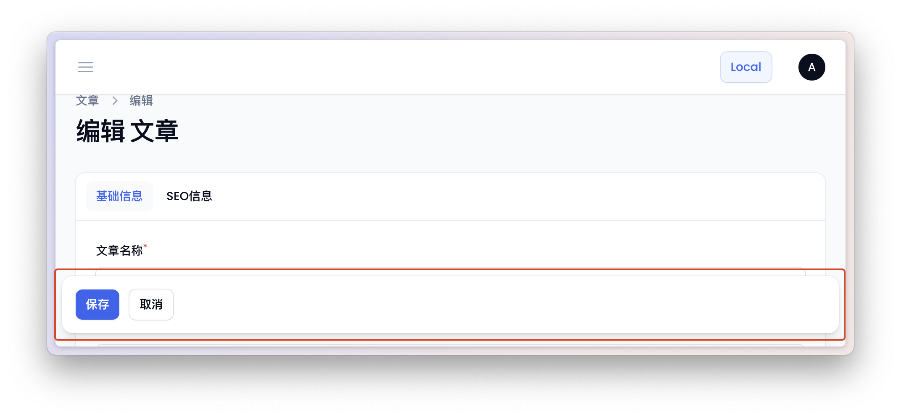
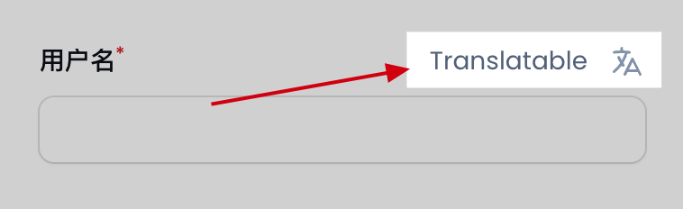
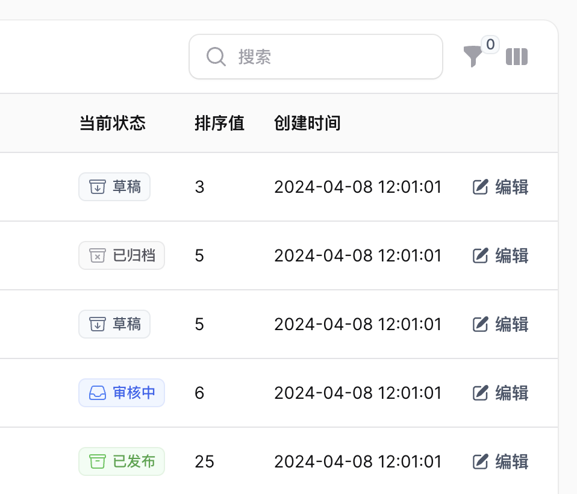
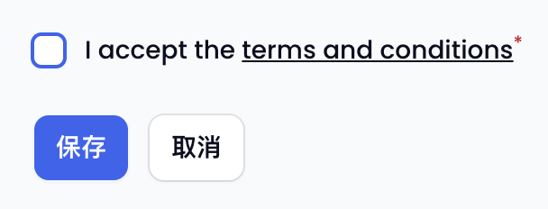
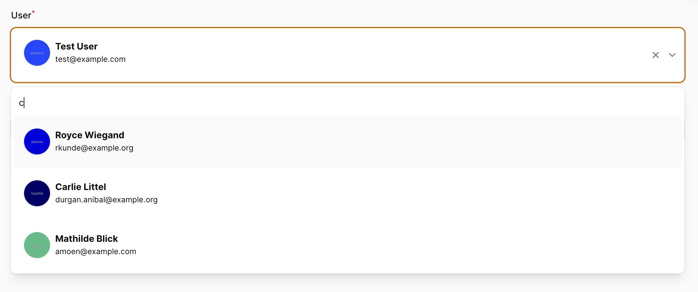

# 表单

## 保存/取消按钮操作Sticky

当新增、编辑表单时，如果表单内容过多，可能会导致保存/取消按钮需要下拉很久才能看到，为此可以在对应的新增、编辑类中添加如下属性解决这个问题。

```php
<?php

namespace App\Filament\Resources\PostCategoryResource\Pages;

class EditPost extends EditRecord
{
    public static bool $formActionsAreSticky = true; // [!code ++]
}
```




## 字段宏 `macro`

如果在项目中使用的是 [filament/spatie-laravel-translatable-plugin](https://github.com/filamentphp/spatie-laravel-translatable-plugin)，可能想向用户展示哪些字段是可翻译的。


在对应字段上使用 `hint()` 和 ` hintIcon()` 方法向用户显示哪些字段是可翻译的。

```php
<?php

use Filament\Forms\Components\TextInput;

// before
TextInput::make('name')
         ->hint('Translatable')
         ->hintIcon('heroicon-m-language');

// after
TextInput::make('name')
    ->translatable(); // [!code ++]
```



如果项目中有很多类似的翻译需求，也可以在 `Filament\Forms\Components\Field` 类上创建一个 `translatable` 宏。

```php
<?php

namespace App\Providers\Filament;

use Filament\Forms\Components\Field;

class AdminPanelServiceProvider extends PanelProvider
{
    // ...
    public function boot()
    {
        Field::macro('translatable', function () { // [!code ++]
            return $this->hint('Translatable') // [!code ++]
                ->hintIcon('heroicon-m-language'); // [!code ++]
        }); // [!code ++]
    }
}
```

## 自定义选择搜索逻辑 `getSearchResultsUsing()`

使用 `getSearchResultsUsing()` 方法自定义“选择”下拉列表以搜索所需的任何自定义逻辑。

- 选择搜索框中键入内容后通过姓名、电子邮件或电话搜索客户

    ```php
    use App\Models\User;
    use App\Models\Role;

    Forms\Components\Select::make('user_id')
        ->searchable()
        ->getSearchResultsUsing(function (string $search): array {
            return User::query()
                ->whereAny(['name', 'email', 'phone'] 'like', "%${search}%")
                ->where('role_id', Role::CUSTOMER)
                ->limit(50)
                ->get()
                ->mapWithKeys(
                    fn (User $customer) => [$customer->id => $customer->name]
                )
                ->toArray();
        })
    ```
  
- 发送外部HTTP请求

  ```php
  use Illuminate\Support\Facades\Http;

  Forms\Components\Select::make('city')
      ->searchable()
      ->getSearchResultsUsing(function (?string $search) {
          if (! filled($search)) {
              return [];
          }

          return Http::get('https://restcountries.com/v3.1/name/'.$search)
              ->collect('*.name')
              ->mapWithKeys(fn ($item) => [$item['common'] => $item['official']])
              ->toArray();
      }),
  ```

## 禁用表单中的字段 `disabledOn()`

如果需要在新增 `create` 或编辑 `edit` 表单中禁用某个字段时可以使用 `disabledOn()` 方法。

::: code-group
```php [编辑时禁用]
public static function form(Form $form): Form
{
    return $form
        ->schema([
            Forms\Components\TextInput::make('name'),
            Forms\Components\TextInput::make('slug')
                ->disabledOn('edit') // [!code ++] 
                ->required(),
                // ...
        ]);
}
```

```php [新增时禁用]
Forms\Components\TextInput::make('slug')
    ->disabledOn('create') // [!code ++] 
    ->required(),
```

```php [新增和编辑时禁用]
Forms\Components\TextInput::make('slug')
    ->disabledOn(['create', 'edit']) // [!code ++] 
    ->required(),
```
:::

## 枚举类

Filament 支持使用枚举类作为单选或下拉选项的选项，并且可以定义对应标签Label、颜色 Color和图标 Icon。

::: code-group

```php [定义枚举类]
<?php

namespace App\Enums;

use Filament\Support\Contracts\HasColor;
use Filament\Support\Contracts\HasIcon;
use Filament\Support\Contracts\HasLabel;

enum Status: string implements HasColor, HasLabel, HasIcon
{
    case Draft = 'draft';
    case Pending = 'pending';
    case Published = 'published';
    case Archived = 'archived';
    case Deleted = 'deleted';

    public function getColor(): string
    {
        return match ($this) {
            self::Draft => Color::Primary->value,
            self::Pending => Color::Info->value,
            self::Published => Color::Success->value,
            self::Archived => Color::Gray->value,
            self::Deleted => Color::Danger->value,
        };
    }

    public function getLabel(): string
    {
        return match ($this) {
            self::Draft => __('enums/status.draft'),
            self::Pending => __('enums/status.pending'),
            self::Published => __('enums/status.published'),
            self::Archived => __('enums/status.archived'),
            self::Deleted => __('enums/status.deleted'),
        };
    }

    public function getIcon(): ?string
    {
        return match ($this) {
            self::Draft => 'heroicon-o-archive-box-arrow-down',
            self::Pending => 'heroicon-o-inbox',
            self::Published => 'heroicon-o-archive-box',
            self::Archived => 'heroicon-o-archive-box-x-mark',
            self::Deleted => 'heroicon-o-trash',
        };
    }

}
```

```php [Post 模型]
use App\Enums\Status;

protected function casts(): array
{
    return [
        'status' => Status::class,
    ];
}
```

```php [PostResource 资源类]
// 表单
public static function form(Form $form): Form
{
  return $form
    ->schema([
       Select::make('status')
          ->native(false)
          ->options(Status::class)
          ->label(__('posts.status_label'))
          ->helperText(__('posts.status_help'))
          ->default(Status::Draft->value),
    ]);
}

// 表格

public static function table(Table $table): Table
{
    return $table
      ->schema([
        TextColumn::make('status')
            ->label(__('posts.status_label'))
            ->disabledClick()
            ->badge(),
    ]);
}
```
:::




## 在标签中渲染 HTML

在字段 `label()` 中需要渲染 HTML（例如链接）的话可以返回 `HtmlString` 对象以便将 HTML 添加到字段标签。

```php
use Illuminate\Support\HtmlString;
 
Forms\Components\Checkbox::make('accept')
    ->label(fn() => new HtmlString('I accept the <a class="underline" href="/terms" target="_blank">terms and conditions</a>'))
    ->required()
```



## 下拉选项中渲染 HTML `allowHtml()`

Filament 默认的 Select 组件通过 `choice.js` 支持渲染带有 HTML 的选项。

> [!TIP] 提示 
> 使用 `allowHtml()` 需要保证渲染的选项数据是安全的，否则可能带来 XSS 攻击。

### 简单用法

通过给选项标签添加HTML标签，可以在下拉选项选择时看到不同的选项文字颜色不同。

```php
use Filament\Forms;

Forms\Components\Select::make('technology')
  ->options([
      'tailwind' => '<span class="text-blue-500">Tailwind</span>',
      'alpine' => '<span class="text-green-500">Alpine</span>',
      'laravel' => '<span class="text-red-500">Laravel</span>',
      'livewire' => '<span class="text-pink-500">Livewire</span>',
  ])
  ->searchable()
  ->allowHtml(),
```

### 自定义选项布局

::: code-group

```php [资源中 Select 组件]
// app\Filament\Resources\PostResource
use App\Models\User;
use Filament\Forms;

// 1. 自定义表单组件
Forms\Components\Select::make('user_id')
    ->label('User')
    ->allowHtml()
    ->searchable()
    ->getSearchResultsUsing(function (string $search) {
        return User::query()
            ->where('name', 'like', "%{$search}%")
            ->limit(50)
            ->get()
            ->mapWithKeys(fn($user) => [$user->getKey() => static::getCleanOptionString($user)]);
    })
    ->getOptionLabelUsing(function ($value): string {
        return static::getCleanOptionString(User::query()->find($value));
    })
    ->required(),


// 2. 自定义渲染逻辑，返回自定义布局的视图
protected static function getCleanOptionString(User $user): string
{
    return view('filament.components.select-user-result')
        ->with('name', $user?->name)
        ->with('email', $user?->email)
        ->with('avatar_url', $user?->avatar_url)
        ->render();
}
```

```php [自定义布局视图]
// resources/views/filament/components/select-user-result.blade.php
<div class="flex rounded-md relative">
    <div class="flex">
        <div class="px-2 py-3">
            <div class="h-10 w-10">
                
            </div>
        </div>

        <div class="flex flex-col justify-center pl-3 py-2">
            <p class="text-sm font-bold pb-1">{{ $name }}</p>
            <div class="flex flex-col items-start">
                <p class="text-xs leading-5">{{ $email }}</p>
            </div>
        </div>
    </div>
</div>
```

```php [用户模型文件]
// app/Models/User.php
<?php

namespace App\Models;

// ...
class User extends Authenticatable
{
    // ...

    public function avatarUrl(): Attribute
    {
        return Attribute::get(fn() => Storage::url($this->avatar));
    }
}
```
:::

经过上面的定义后可以看到下拉组件的选项被修改为自定义的布局。

::: details 切换查看下拉效果

:::

## 编辑表单中的唯一记录

在编辑表单中，如果需要确保表单中只有一个记录，可以使用 `->unique()` 方法。

如果使用 `->unique()` 进行验证，请不要忘记忽略编辑表单中的当前记录。否则将在编辑表单中收到验证错误 `The [field] has already been taken.`。

```php
TextInput::make('name')
    ->required()
    ->unique(), // [!code --] 
    ->unique(ignoreRecord: true), // [!code ++]
```

## 关联关系自定义选项显示 `getOptionLabelFromRecordUsing()`

当在选择菜单或过滤器中使用关系并且该模型是可翻译的时，以下是获取可翻译属性的方法：

```php
Forms\Components\Select::make('roles')
  ->label(__('filament-shield::filament-shield.resource.label.role'))
  ->relationship('roles', 'name')
  ->getOptionLabelFromRecordUsing(
      fn (Forms\Components\Select $component, Model $record) => Role::tryFrom($record->name)?->getLabel()
  )
  ->multiple()
  ->preload()
  ->searchable(),
```

更多详情可以[查看这个 issue](https://github.com/filamentphp/filament/issues/11872#issuecomment-2002574212)。

## 密码字段加密和更新处理

在处理密码字段时，编辑密码字段和创建时密码字段的要求是不一样的，比如更新用户数据。


::: code-group
```php [密码字段]
use Filament\Forms\Components\TextInput;
 
TextInput::make('password')
    ->password()
```

```php [对字段进行哈希处理]
use Filament\Forms\Components\TextInput;
use Illuminate\Support\Facades\Hash;
 
TextInput::make('password')
    // 密码字段，不明文显示输入
    ->password()
    ->dehydrateStateUsing(fn ($state) => Hash::make($state))
```


```php [如果字段为空则不覆盖现有密码]
use Filament\Forms\Components\TextInput;
use Illuminate\Support\Facades\Hash;
 
TextInput::make('password')
    ->password()
    // 如果字段不为空则加密字符串
    ->dehydrateStateUsing(fn ($state) => Hash::make($state))
    // 如果字段为空则不覆盖现有密码
    ->dehydrated(fn ($state) => filled($state))
```

```php [资源创建时字段必须填写]
use Filament\Forms\Components\TextInput;
use Filament\Pages\Page;
use Illuminate\Support\Facades\Hash;
 
TextInput::make('password')
    ->password()
    ->dehydrateStateUsing(fn ($state) => Hash::make($state))
    // 当为空时则不提交当前字段
    ->dehydrated(fn ($state) => filled($state)) // [!code ++]
    // 编辑页面当前字段非必填
    ->required(fn (string $operation): bool => $operation === 'create') // [!code ++]
```
:::