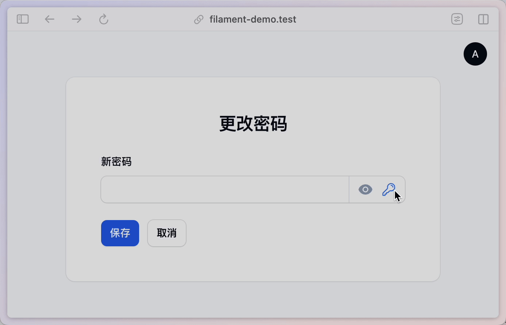

# 操作

## 发送自定义事件

在 Livewire 中使用 `$dispatch()` 方法来发送自定义时间，达到不同组件通讯的目的。

在实际项目也有类似的需求，比如一个资源列表的删除操作执行后，需要向小组件发送一个事件，来更新小组件的数据。

```php
// app\Filament\Resources\UserResource\Pages\UserResource.php

->actions([
    // ...
    Tables\Actions\DeleteAction::make()
        ->after(function (Pages\ManageUsers $livewire) {
            $livewire->dispatch('refreshUserOverview');
        }),
])
```

然后在用户的小组件 `OverviewWidget` 中添加事件监听器。

```php
// app\Filament\Resources\UserResource\Widgets\UserOverview.php

protected function getListeners(): array
{
    return [
        'refreshUserOverview' => '$refresh',
    ];
}
```

项目源代码[点击这里查看](https://github.com/curder/filament-widget-refresh-demo)。

## 以多种形式重用 Action 类

在 filament 中可以通过编写动作类来简化用户的输入，比如修改密码时需要输入新密码和重复密码的情况。



```php
// app\Filament\Actions\GeneratePasswordAction.php

<?php

declare(strict_types=1);

namespace App\Filament\Actions;

use Filament\Forms\Components\Actions\Action;
use Filament\Forms\Set;
use Filament\Notifications\Notification;
use Illuminate\Support\Str;

/**
 * 生成新密码
 */
class GeneratePasswordAction extends Action
{
    protected function setUp(): void
    {
        parent::setUp();

        $this->color('info')
            ->icon('heroicon-o-key')
            ->action(function (Set $set) {
                $password = Str::password();

                $set('password', $password); // 将新生成的密码赋值给新密码字段
                $set('passwordConfirmation', $password); // 将新生成的密码赋值给确认密码字段

                // 发送通知
                Notification::make()
                    ->success()
                    ->title(__('Password successfully generated'))
                    ->send();
            });
    }

    public static function getDefaultName(): ?string
    {
        return 'generatePassword';
    }
}
```

在表单中可以这样使用：

```php
use App\Filament\Actions\GeneratePasswordAction;

public function form(Form $form): Form
{
    return $form
        ->schema([
            $this->getPasswordFormComponent(), // [!code --]
            $this->getPasswordFormComponent()->suffixAction(GeneratePasswordAction::make()), // [!code ++]
            $this->getPasswordConfirmationFormComponent(),
        ]);
}
```
