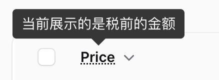

# 表格

## 自定义行样式 `recordClasses()`

::: details 点击切换 gif 演示

:::

通过 `recordClasses()` 方法可以自定义表格行的样式，比如下面是根据记录值将不同的样式应用于表行。

::: code-group
```php [PostResource]
 public static function table(Table $table): Table
    {
        return $table
            ->recordClasses(fn (Post $record) =>  match($record->published) { // [!code ++]
                true => 'border-l-4 !border-l-danger-500 bg-danger-50 dark:bg-gray-800', // [!code ++]
                default => null, // [!code ++]
            }) // [!code ++]
            ->columns([
                TextColumn::make('name'),

                ToggleColumn::make('published_at')
                    ->onColor('danger')
                    ->offColor('success')
                    ->updateStateUsing(function ($record, $state) {
                        $record->update(['published_at' => $state ? now(): null]);
                    }),
            ]);
}
```

```php [Model]
<?php

// ...
class Post extends Model
{
    // ...
    public function cases(): array
    {
        return [
            'published_at' => 'datetime',
        ];
    }

    public function published(): Attribute
    {
        return Attribute::get(fn() => !is_null($this->published_at));
    }
}
```

:::

::: tip **注意**
由于我们自定义了一些 TailwindCss 样式，建议创建[自定义主题](customize-panel.md#自定义主题)来覆盖默认主题样式。
:::

## 表格列上添加操作 `action()`

:::details 点击切换 gif 演示

:::

使用 `action()` 方法来添加自定义操作。

```php
public static function table(Table $table): Table
    {
        return $table
            ->columns([
                // ...
                Tables\Columns\TextColumn::make('status')
                    ->searchable()
                    ->badge()
                    ->alignCenter()
                    ->action(
                        Tables\Actions\Action::make('change_status')
                            ->stickyModalHeader()
                            ->modalHeading('Change user status')
                            ->requiresConfirmation()
                            ->fillForm(fn(User $record) => ['status' => $record->status])
                            ->form([
                                Forms\Components\ToggleButtons::make('status')
                                    ->required()
                                    ->inline()
                                    ->options(UserStatus::class),
                            ])
                            ->action(function (Tables\Actions\Action $action, User $record, array $data) {
                                $record->update($data);
                            })
                            ->modalWidth(MaxWidth::ExtraLarge)
                            ->modalAlignment(Alignment::Start),
                    ),
            ]);
    }
```

## 向表头列添加提示

在服务提供者 `AdminPanelPorvider` 的 `boot` 启动方法中添加 `abbr` 宏：

```php
public function boot(): void
{
    \Filament\Tables\Columns\TextColumn::macro('abbr', function (?string $abbr = null, bool $asTooltip = false) {
        $label = $this->getLabel();
        $abbr = $abbr ?? $label;
        $classes = $this->isSortable() ? 'cursor-pointer' : 'cursor-help';
     
        $attributes = $asTooltip ? 'x-tooltip.raw="'.$abbr.'" title=""' : 'title="'.$abbr.'"';
     
        return $this->label(new HtmlString("<abbr class=\"$classes\" $attributes>$label</abbr>"));
    });
}
```

在对应的资源类中添加引用：

```php
\Filament\Tables\Columns\TextColumn::make('price')
  ->abbr('当前展示的是税前的金额', asTooltip: true) // [!code ++]
  ->sortable(),
```



## 自定义表格点击行URL `recordUrl()`

默认表格行点击的跳转地址是编辑页面，使用 `recordUrl()` 方法可以自定义表格点击行时跳转的 URL。

::: code-group

```php [跳转到编辑页]
use Illuminate\Database\Eloquent\Model;

public static function table(Table $table): Table
{
    return $table
        // ...
        ->recordUrl(fn (Model $record) => Pages\EditPost::getUrl([$record])), // [!code ++]
}
```

```php [跳转到详情页]
use Illuminate\Database\Eloquent\Model;

public static function table(Table $table): Table
{
    return $table
        // ...
        ->recordUrl(fn (Model $record) => Pages\ViewPost::getUrl([$record])), // [!code ++]
}
```

:::

也可以返回空字符串或 `null`，这样点击表格行时没有任何反应。

::: details 关联提示

如果不存在对应的页面可以通过 `make:filament-page` 或者 `filament:page` 命令创建，比如使用下面的命令创建详情页面：

```shell
php artisan filament:page --resource PostResource --type View ViewPost
```

- `--resource` 参数值为对应页面所属资源
- `--type` 参数值为对应页面的类型，类型包括
    - `Custom` 自定义页面
    - `ListRecords` 列表页面
    - `CreateRecord` 创建页面
    - `EditRecord` 编辑页面
    - `ViewRecord` 详情页面
    - `ManageRelatedRecords` 关联关系页面
    - `ManageRecords` 简单列表页(相当于使用 `php artisan make:filament-resource Post --simple` 命令生成资源时的页面文件)
:::

## 表格行操作仅显示图标

如果认为表格操作相关的编辑或删除等操作占用了表格太多空间，可以通过配置 `label('')`，仅显示图标来缩短它。

```php
use Filament\Tables\Actions\DeleteAction;
use Filament\Tables\Actions\EditAction;

 public static function table(Table $table): Table
    {
        return $table
            // ...
            ->actions([
                EditAction::make()->label(''),
                DeleteAction::make()->label(''),
                // ...
            ]);
```

## 格式化输出 `formatStateUsing()`

有些需求下需要将多个数据库字段合并到一个表列中，可以通过使用 `->formatStateUsing()` 方法来完成这个操作。

```php
Tables\Columns\TextColumn::make('user.full_name')
    ->label('Customer Name')
    ->formatStateUsing(
        fn ($state, Order $order) => $order->user->first_name . ' ' . $order->user->last_name
    ),
```

## 渲染 HTML

### 标签 `label()`

在字段 `label()` 中需要渲染 HTML（例如链接）的话可以返回 `HtmlString` 对象以便将 HTML 添加到字段标签。

```php
use Filament\Tables;
use Illuminate\Support\HtmlString;
 
Tables\Components\TextColumn::make('name')
    ->label(fn() => new HtmlString('<span style="color: red;">Name</span>'))
```

### 渲染内容

#### `html()` 方法

如果列的内容是 HTML，可以使用 `html()` 方法呈现它：

```php
use Filament\Tables;
 
TextColumn::make('description')
    ->html() // [!code ++]
```

> HTML 将在呈现之前对任何潜在的不安全内容进行清理。

#### `formatStateUsing()` 方法

- 通过返回 `\Illuminate\Support\HtmlString` 实例

    ```php
    use Filament\Tables;
    use Illuminate\Support\HtmlString;

    Tables\Columns\TextColumn::make('name')
        ->formatStateUsing(fn (string $state): HtmlString => new HtmlString($state)) // [!code ++]
    ```

- 通过返回 `\Illuminate\Contracts\View\View` 实例

    ```php
    use Filament\Tables;
    use Illuminate\Contracts\View\View;
     
    Tables\Columns\TextColumn::make('name')
        ->formatStateUsing(fn (string $state): View => view( // [!code ++]
            'filament.tables.columns.name-content', // [!code ++]
            ['state' => $state], // [!code ++]
        )) // [!code ++]
    ```

## 删除记录时删除附件

当用户删除记录时，Filament 不会删除资源对应所上传的文件。

可以在 DeleteAction 操作的 `after()` 方法中编写对应逻辑：

```php
Actions\DeleteAction::make()
    ->after(function (YourModel $record) {
        // delete single
        if ($record->photo) {
            Storage::disk('public')->delete($record->photo);
        }
        // delete multiple
        if ($record->galery) {
            foreach ($record->galery as $ph) Storage::disk('public')->delete($ph);
        }
    })
```

## 批量删除时过滤数据

可以在 `before()` 方法中提供对应的回调逻辑，然后调用 `cancel()` 方法取消删除操作：

```php
Tables\Actions\DeleteBulkAction::make()
    ->before(function (Collection $records, Tables\Actions\DeleteBulkAction $action) {
      $exists = $records->pluck('name')->filter(
                      fn (string $item) => \App\Enums\Role::hasLabel($item)
                  )->isNotEmpty();

      if ($exists) {
          Notification::make()
              ->title('Errors!')
              ->body("You can't delete roles because it is the default role for current system.")
              ->status('danger')
              ->send();

          $action->cancel();
      }
})
```
