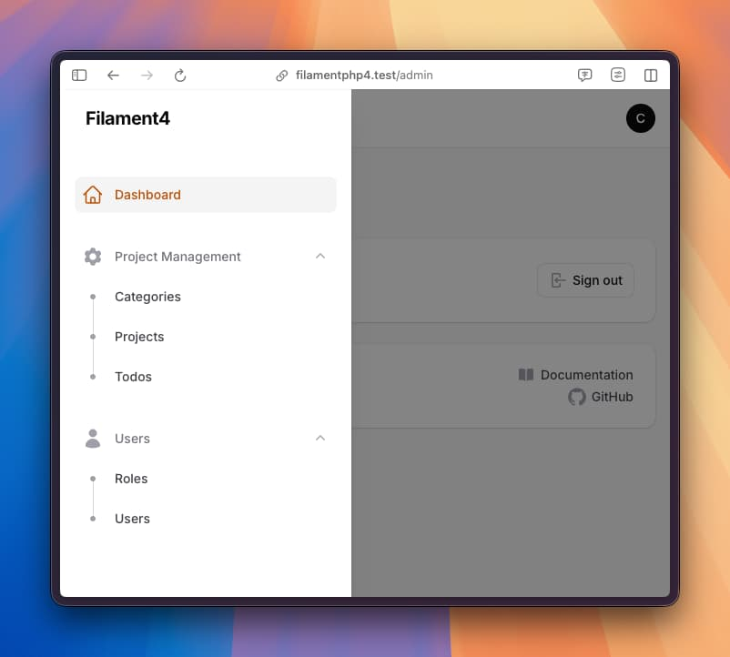
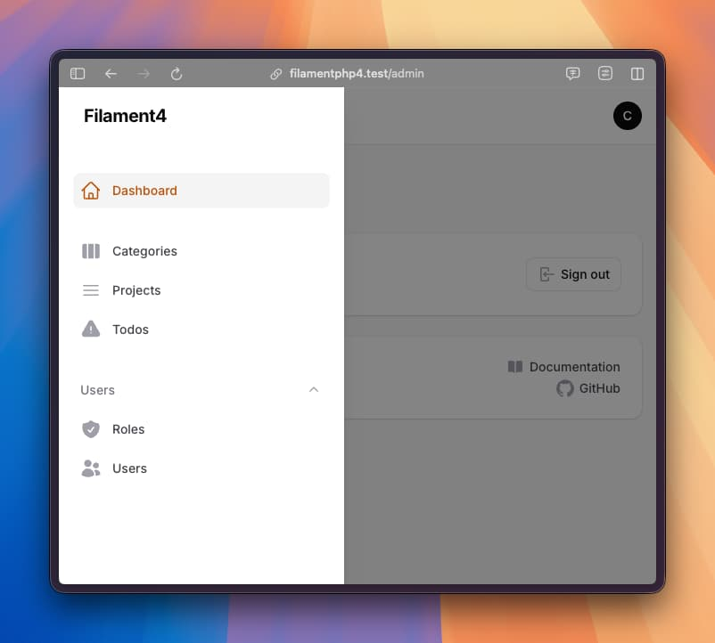

# 面板 Panel Builder {#panel-builder}

## 导航分组 {#navigation-groups}

如果在面板中使用到了导航组，可以考虑使用枚举来配置不同的分组。

::: code-group
```php [Panel 配置]
// App\Providers\Filament\AdminPanelProvider.php
use App\Enums\NavigationGroupEnum; // [!code ++]

public function panel(Panel $panel): Panel
{
    return $panel
            ->navigationGroups(NavigationGroupEnum::class); // [!code ++]
}
```

```php [定义导航组枚举]
<?php

namespace App\Enums;

use BackedEnum;
use Filament\Support\Icons\Heroicon;
use Filament\Support\Contracts\HasIcon;
use Filament\Support\Contracts\HasLabel;
use Illuminate\Contracts\Support\Htmlable;
use Filament\Support\Contracts\Collapsible;

enum NavigationGroupEnum implements Collapsible, HasIcon, HasLabel
{
    case ProjectManagement;
    case UserManagement;

    // 定义导航分组图标
    public function getIcon(): string|BackedEnum|null
    {
        return match ($this) {
            self::ProjectManagement => Heroicon::Cog6Tooth,
            self::UserManagement => Heroicon::User,
        };
    }

    // 定义导航分组文本
    public function getLabel(): string|Htmlable|null
    {
        return match ($this) {
            self::ProjectManagement => __('navigations.project_management'),
            self::UserManagement => __('navigations.user_management'),
        };
    }
    
    // 决定导航组是否可以被折叠
    // 如果 true，显示折叠/展开按钮；如果 false，不显示折叠按钮，始终保持展开
    public function isCollapsible(): bool
    {
        return true; 
    }

    // 决定导航组是否处于折叠状态
    // 如果 true，组默认处于折叠状态；如果 false，默认展开
    public function isCollapsed(): bool
    {
        return false;
    }
}
```

```php [UserResource 使用]
// App\Filament\Resources\UserResource.php
use App\Enums\NavigationGroupEnum;

class UserResource extends Resource
{
    protected static ?string $model = User::class;

    //    protected static string|BackedEnum|null $navigationIcon = Heroicon::Users;
    protected static string|UnitEnum|null $navigationGroup = NavigationGroupEnum::UserManagement; // [!code ++]
    // ...
}

```
```php [ProjectResource 使用]
// App\Filament\Resources\ProjectResource.php
use App\Enums\NavigationGroupEnum;

class ProjectResource extends Resource
{
    protected static ?string $model = User::class;

    //    protected static string|BackedEnum|null $navigationIcon = Heroicon::Bars3;
    protected static string|UnitEnum|null $navigationGroup = NavigationGroupEnum::ProjectManagement; // [!code ++]
    // ...
}
```
:::

使用枚举优势如下：

- 在一个地方 `NavigationGroupEnum` 管理导航组
- 通过实现 `Collapsible` 接口来控制导航组是否可折叠以及默认的折叠状态

  :::tip 建议
  如果希望导航组始终保持展开状态 `isCollapsed()` 应该返回 `false`。如果希望禁止折叠功能 `isCollapsible()` 应该返回 `false`。
  :::

- 通过实现 `HasLabel` 接口将导航组翻译成多种语言
- 通过实现 `HasIcon` 接口来管理图标
- 只需改变枚举的顺序即可轻松更改组的排序

通过上面的配置得到的导航分组如下：



### 无分组 {#navigation-groups-no-group}

如果不想在导航分组中显示文本，可以将 `getLabel` 方法返回空字符串 `''`：

```php
// app/Enums/NavigationGroupEnum.php

<?php

namespace App\Enums;
// ...
enum NavigationGroupEnum implements HasIcon, HasLabel
{
    case ProjectManagement;
    case UserManagement;

    // ...

    public function getLabel(): string|Htmlable|null
    {
        return match ($this) {
            // self::ProjectManagement => 'Project Management', //[!code --]
            self::UserManagement => 'Users',
            default => '', //[!code ++]
        };
    }
}
```

这样默认无分组的资源会默认被放到最前面，而有分组的资源会被放到后面：


### 自定义资源图标 {#navigation-groups-custom-icon}

当使用枚举来配置导航分组时，可以不实现 `HasIcon` 接口来使用默认图标，这样对应的资源可以通过定义 `$navigationIcon` 来达到自定义图标的目的：

```php
// app/Enums/NavigationGroupEnum.php
<?php

namespace App\Enums;

use BackedEnum; //[!code --]

enum NavigationGroupEnum implements HasLabel
{
    case ProjectManagement;
    case UserManagement;

    public function getIcon(): string|BackedEnum|null //[!code --]
    { //[!code --]
        return match ($this) { //[!code --]
            self::ProjectManagement => Heroicon::Cog6Tooth, //[!code --]
            self::UserManagement => Heroicon::User, //[!code --]
        }; //[!code --]
    } //[!code --]

    // ...
}
```

:::danger 注意

资源 `$navigationIcon` 和导航组枚举 `getIcon` 方法只能二选一，当资源的 `$navigationIcon` 定义了图标且导航组枚举也实现了 `HasIcon` 接口时，会抛出错误。：

```
Exception
vendor/filament/filament/resources/views/components/sidebar/group.blade.php:171

Navigation group [] has an icon but one or more of its items also have icons. Either the group or its items can have icons, but not both. This is to ensure a proper user experience.
```
:::

