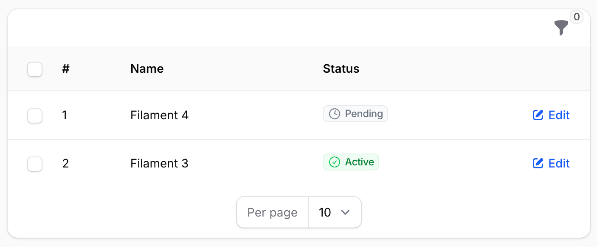

# 表格 {#tables}

## 表格添加行号 {#table-with-row-numbers}

如果想将行号显示为表格列，请使用 [`$rowLoop` 变量](https://filamentphp.com/docs/4.x/tables/columns/overview#injecting-the-row-loop)，它的工作方式类似于 Laravel 的 `foreach` 循环中的 `$loop` 变量。<!-- markdownlint-disable MD013 -->

```php
use Filament\Tables\Columns\TextColumn;

TextColumn::make('row_number')
    ->label('#')
    ->state(fn (stdClass $row): int => $rowLoop->iteration)), // [!code ++]    
```

要在表格中添加行号，也可以使用 `rowIndex()` 选项。例如：

```php
use Filament\Tables\Columns\TextColumn;

TextColumn::make('row_number')
    ->label('#')
    ->rowIndex(), // [!code ++]
```


